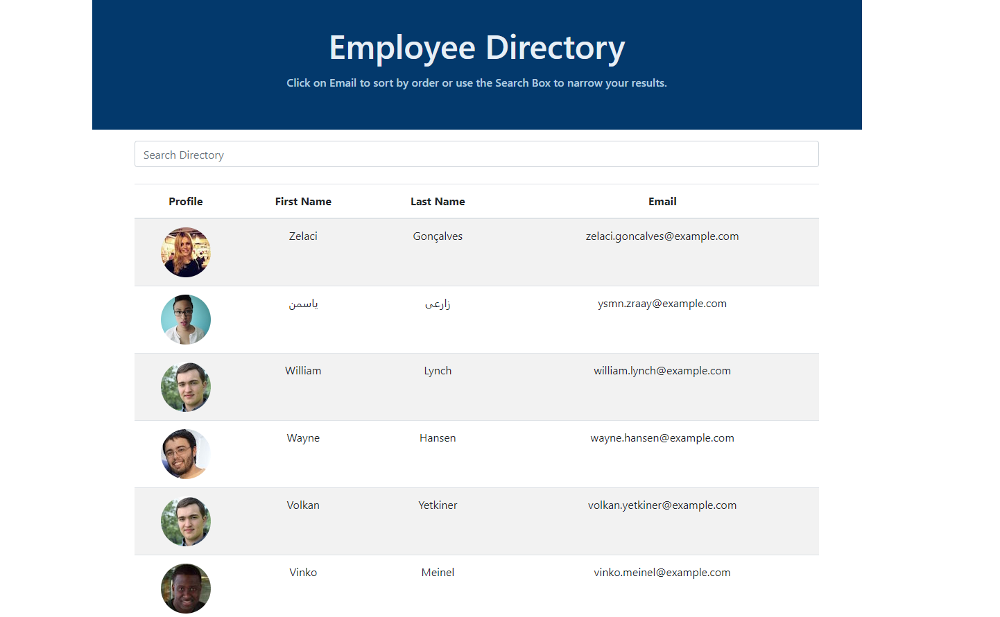

# Employee Directory
  
  
## Description 
  
Employee Directory is created using React with class. This application will load a set of random employees along with their profile pictures, first name, last name, and their emails. User then able to sort by decending or asending order when click the email, or narrow the search results when type in the search box. 

## Table of Contents

* [Installation](#Installation)
* [Usage](#Usage) 
* [Contributing](#Contributing)
* [License](#License)
* [Questions](#Questions)
  

## Installation 
  
Please run the following command to install required software:

```
npm install
npm start
```


## Usage

These are the technologies and languages use for this project: React, bootstrap , axios

Deployed Github Link:   https://vinhkhamhuynh.github.io/employee-directory/
Github Repository Link: https://github.com/vinhkhamhuynh/employee-directory
  


   
## License 
  


 
This project is licensed under the MIT license. For more information, click here: https://spdx.org/licenses/MIT.html 
 


## Questions
  
Please follow me on Github for more projects: [vinhkhamhuynh](https://github.com/vinhkhamhuynh) 

For any questions or to report issues, please email me at: vinhkhamhuynh@gmail.com
  

